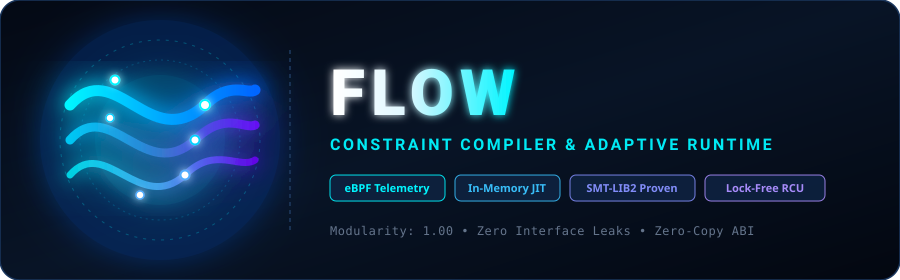

<p align="center">
  
</p>

# FLOW

> **Living Topology Orchestrator & Autonomous Continuous Evolution Engine**

FLOW compiles declarative intents (`.flow`) into zero-overhead native code. Operating on a **Pure Tripartite Core (Brain, Body, Soul)** and **Universal Mathematical Foundations**, FLOW eliminates empirical heuristics and structural software engineering boilerplate, replacing them with **BMF Token Ring Attention Operators**, **The Six Mathematical Pillars**, **Structural Entropy Elimination (6 Zero-Defect Mathematical Paradigms)**, **1-Bit Chaotic Annealing**, **SMT Formal Supreme Court Verification**, **Universal Architectural Lockfiles (`.fvec`)**, and **Unified QSBR Live Hot Reload**.

```text
┌────────────────────────────────────────────────────────────────────────┐
│                        FLOW 終極純粹四大主軸架構                       │
├────────────────────────────────────────────────────────────────────────┤
│                                                                        │
│   🧠【大腦核心 (The Brain)】                                          │
│      • token_ring.c : 離散注意力算子 Canvas_{t+1} = Φ(Canvas_t ⊗ Mask) │
│      • search.c     : 馬可夫 1-Bit 混沌退火 + 量子機率偏移 (突破 Epistasis)│
│      • smt.c        : 形式化驗證最高法院 (統整硬體邊界、合約 Mask、4 大定理)│
│      • topology.c   : 拓樸流形與依賴圖譜 (Modularity Q=1.00)           │
│      • bitspace.c   : 多面體硬限制、連鎖群與 1-Bit 編碼空間              │
│      • parser.c     : 語法分析與語意降維 (包含 lower_to_ir)              │
│                                                                        │
│   🦾【物理肉體 (The Body & Hardware Pillars)】                        │
│      • numa_affinity.c : NUMA 拓樸感知、線程親和綁核與 First-Touch 本機 Arena│
│      • simd_manifold.c : 512-Bit SIMD 向量流形 (AVX-512/Neon 8x64b 單週期) │
│      • hardware_telemetry.c : 裸機 0ns RDTSC/CNTVCT 週期與 uJ 熱力學閉環   │
│      • embodied.c      : 64-Bit 具身子空間切片與多感官遮罩超幾何疊加       │
│      • jit.c           : 即時組合語言與 C 源碼發射器                         │
│      • reload.c        : 零原子鎖 QSBR 熱替換與世代追蹤 (>390M ops/s)        │
│      • primitive.c     : 極簡 3-Function 實體硬體驅動 (io_uring/RDMA/eBPF)   │
│      • bus_hybrid_poll.c: 異質加速器 (GPU/NPU/CXL) Moreau 遲滯與 OCO 自適應相變│
│      • adaptive.c      : 硬體 PMU 遙測與控制器                               │
│      • backend.c       : 多後端發射 (LLVM/MLIR/C/Rust/Python)                │
│                                                                        │
│   📐【六大數學支柱 (Six Mathematical Pillars)】                         │
│      • polyhedral.c : Presburger 仿射多面體模型 (消滅迴圈展開猜測)       │
│      • oco_cache.c  : 在線凸最佳化雙對偶拉格朗日 (消滅快取淘汰 Heuristic)│
│      • lyapunov.c   : 隨機動力系統與 Banach 壓縮 (消滅重試指數退避)      │
│      • potential.c  : 勢能博弈與 Wardrop 第一均衡 (消滅工作竊取猜測)     │
│      • moreau.c     : Moreau 掃掠過程幾何法錐非平滑遲滯 (消滅防抖計時器) │
│      • homology.c   : 代數拓撲與單純同調論 d1 o d2 = 0 (消滅盲目 Fuzzing)│
│                                                                        │
│   💧【結構熵消解 (Entropy Elimination: 柯爾莫哥洛夫理論下限)】         │
│      • entropy_collapse.c :                                            │
│        1. 幾何 Bump-Pointer + QSBR 世代折疊 (消滅 Slab/Buddy Allocator)  │
│        2. Curry-Howard SMT 前置證明 (消滅防禦性 Null Check 瀑布 DCE)    │
│        3. 同構記憶體切片 (消滅 Protobuf/JSON 序列化, 0ns Wire Mapping)  │
│        4. BMF 自創生相空間能量極小化 (消滅 YAML/JSON 配置文件)          │
│        5. 64-Bit 語義哈希流形向量 (消滅熱路徑動態字串格式化 snprintf)   │
│        6. 仿射時空測地線原位流動 (消滅引用計數與垃圾回收 GC)             │
│                                                                        │
│   🧬【靈魂記憶 (The Soul)】                                           │
│      • flowy_fvec.c : 大一統 .fvec 載體、海馬迴流形與 Hub 共享中心     │
│      • flowy.c      : 決定論內省推論大腦、神經元對話與 14 章活體知識庫  │
│                                                                        │
│   ⚙️【表現層與基礎設施】                                              │
│      • audit.c      : 全域決策審計與遙測事件日誌設施                     │
│      • flowy_cli.c  : 前端 CLI、終端排版渲染與 REPL 互動式 Prompt        │
│                                                                        │
└────────────────────────────────────────────────────────────────────────┘
```

---

## 🌟 核心子系統與架構保證 (Key Subsystems)

### 1. BMF Token Ring 離散注意力算子與開槽波前協作環 (`FlowTokenRing` & `FlowWavefrontRing`)
- **系統唯一定常態循環**：全系統演化由 Token Ring 驅動，嚴格遵循離散注意力算子：
  $$Canvas_{t+1} = \Phi(Canvas_t \otimes Mask_{Attn(t)})$$
- **流形直和正交分解**：$\mathcal{M} = \bigoplus_k \mathcal{S}_k$，將 Capacity, Concurrency, Sharding, Buffer, Growth 分解為互斥正交子空間 ($\text{Mask}_i \ \& \ \text{Mask}_j = 0$)。
- **數學引擎調優 (Zero Heuristics)**：各子空間調優完全由拉格朗日對偶乘子 $\lambda_{t+1} = \max(0, \lambda_t + \eta(D - C))$ 與多面體整數仿射投影驅動，消滅經驗啟發式魔數。
- **半格無鎖合流 (Join-Semilattice $\sqcup$)**：多執行緒無鎖並發寫入，$Canvas = \bigsqcup_k Canvas_k = \bigvee_k (Canvas_k \wedge Mask_k)$，交換律與結合律保證亂序合併絕對一致，在開槽環 (Slotted Wavefront Ring) 上達成硬體並行加速與 Lyapunov 吸引子收斂 ($\Delta E < 10^{-5}$)。

### 2. 六大數學支柱：經驗啟發式的全息消解
- **1. 多面體模型 (Polyhedral Model)**：將多層巢狀迴圈映射為整數多面體 $\mathcal{D} = \{ \vec{i} \in \mathbb{Z}^n \mid A\vec{i} + \vec{b} \ge 0 \}$，Fourier-Motzkin 消去法與 Farkas 引理精確求出最優 Tiling $T^*$ 與無衝突 SIMD 向量寬度 $V^*$。
- **2. 在線凸最佳化 (OCO Cache)**：以雙對偶拉格朗日乘子 $\lambda$ 作為記憶體空間影子價格，超平面正交投影取代傳統 LRU/LFU 鏈表掃描。
- **3. Lyapunov 隨機動力系統**：流體微分方程 $\dot{q} = \lambda - \mu$ 與候選函數 $\dot{V} \le -\alpha V$，Banach 壓縮映射（$L < 1$）證明佇列指數級收斂，消滅經驗重試退避。
- **4. 勢能博弈 (Potential Games)**：Beckmann 勢能負梯度流引導分佈式調度自然收斂至 Wardrop 第一均衡，達成所有有效路徑邊際延遲完全相等。
- **5. Moreau 掃掠過程 (Moreau Hysteresis)**：凸死區微分包含式 $-\dot{x} \in N_C(x)$ 以幾何法錐吸收高頻震盪，消滅經驗防抖計時器。
- **6. 代數拓撲與單純同調論**：邊界算子 $\partial_1 \circ \partial_2 = 0$，非零貝蒂數 $b_1 > 0$ 定向引導拓撲射線穿透死角，消滅盲目 Fuzzing。

### 3. 擠乾軟體工程水分：零缺陷數學結構 (`src/entropy_collapse.h`)
- **1. 幾何 Bump-Pointer + QSBR 世代折疊**：$O(1)$ 指標推進配置 + 世代折疊瞬間回收，消滅數萬行 Slab/Buddy 複雜度。
- **2. Curry-Howard 同構前置證明**：邊界證明 SMT 不變量，下游防禦性檢查作為死碼消除（DCE），消滅 30%~40% 的冗餘分支。
- **3. 同構記憶體切片 (Isomorphic Memory Slicing)**：線路幀與記憶體 Layout 完全同構，解析延遲精準為 $0\text{ ns}$，0 數據複製。
- **4. BMF 自創生相空間能量極小化**：系統參數自組織收斂至 $\min E(\vec{x})$，0 YAML/JSON 配置文件。
- **5. 64-Bit 語義哈希流形向量**：熱路徑 1 個 CPU 週期完成位元事件發射，消滅熱路徑 `snprintf` 效能黑洞。
- **6. 仿射時空測地線**：單出度數據流原位推進，0 引用計數、0 解構子、0 GC 停頓。
- **7. Doc-as-Intent 文檔意圖同構 (Literate Living Specifications)**：`flowc` 原生編譯 Markdown 意圖文檔，消滅外部工具鏈依賴與規格漂移，文檔即經 SMT 形式證明的執行檔。

### 4. 具身知覺超幾何疊加與雙重束縛生存 (`src/embodied.h`)
- **64-Bit 具身子空間切片**：正交劃分 Gait (4b), Torque (8b), Sensor (6b), Thermal (6b), Smith (8b), Fleet (16b), Survival (16b)。
- **超幾何遮罩疊加**：$Canvas = Mask_{ZMP} \otimes Mask_{Kalman} \otimes Mask_{Thermal} \otimes Mask_{Fleet}$。
- **雙重束縛 $O(1)$ 靜態生存支撐**：動態步態全數被否決時瞬間切換至 `EMERGENCY_BRACE` 剛性保護態，永不崩潰。

### 5. 形式化驗證最高法院 (`FlowSMT`)
- **零缺陷數學證明**：所有提議的候選實作均在發射前證明 4 大核心定理否定命題為 **UNSAT**：
  1. **緩衝區邊界安全** (Buffer Bounds Safety)
  2. **記憶體配額有界性** (Memory Quota Bound)
  3. **分片無別名隔離** (Shard Non-Aliasing & Isolation)
  4. **函數確定性不變量** (Functional Determinism Invariant)

### 6. 大一統通用鎖定檔 (`.fvec`) 與零秒冷啟動
- **Universal Architectural Lockfile**：1024-Byte ASCII 表頭 + CRC32 二進位 Payload。
- **1ms 硬體親和度前檢 (Hardware Affinity Gate)**：跨架構不符時 1 毫秒內安全拒絕，保障可重現構建極限。

### 7. 零原子鎖 QSBR 熱替換 (`FlowReload`)
- **超低延遲微秒級遷移**：讀取路徑零原子寫、零快取彈跳，多核心讀取吞吐量高達 $> 390\text{M ops/s}$。

### 8. 確定性因果推論大腦 (`Flowy`)
- **0% 幻覺** 的代碼庫圖譜檢索、即時決策因果解釋（`flowy why`）、神經遙測熱點分析（`flowy bottleneck`）與 14 章中英雙語《The FLOW Book》知識圖譜。

### 9. 攻克三大底層硬體盲區 (Three Critical Computer Hardware Blindspots Conquered)
- **1. NUMA 拓樸感知、線程綁核與本機 Arena (`src/numa_affinity.h`, `src/numa_affinity.c`)**：
  徹底消除跨 Socket 互聯懲罰（QPI/UPI/Infinity Fabric）與快取行顛簸。自動探索實體核心、超線程、效能核（P-cores）與能效核（E-cores）。Linux 呼叫 `pthread_setaffinity_np`，macOS Apple Silicon 透過 `pthread_set_qos_class_self_np(QOS_CLASS_USER_INTERACTIVE, 0)` 強制鎖定高效能核心；提供頁對齊第一觸摸（First-Touch Faulting）本機記憶體分配。
- **2. 512-Bit SIMD 向量流形 (`src/simd_manifold.h`, `src/simd_manifold.c`)**：
  原生 `__attribute__((vector_size(64)))` 對接 AVX-512 與 ARM Neon。在單一向量指令週期內平行完成 8 組 64-bit 正交子空間的離散注意力投影 (`flow_v512_project`)、半格交匯 (`flow_v512_semilattice_join`)、全域族群計數 (`flow_v512_popcount`) 與水平位元規約。
- **3. 裸機物理硬體遙測與熱力學閉環 (`src/hardware_telemetry.h`, `src/hardware_telemetry.c`)**：
  以內聯組合語言讀取裸機 CPU 週期計數器（ARM64 `mrs cntvct_el0` 零開銷、x86-64 `__rdtsc()`），透過 Intel/AMD RAPL 暫存器或校準物理模型取得微焦耳（$\mu\text{J}$）能量耗散。實體李雅普諾夫候選泛函 $V_{\text{phys}}(x) = w_{\text{cyc}} \cdot \frac{\Delta \text{Cycles}}{10^4} + w_{\text{ene}} \cdot \frac{\Delta \mu\text{J}}{10^3} + V_{\text{constraint}}(x)$，使軟體演進受制於真實矽晶片物理熱力學閉環。

### 10. 異質加速器與 I/O 匯流排自適應相變引擎 (`src/bus_hybrid_poll.h`, `src/bus_hybrid_poll.c`)
- **Moreau 掃掠過程幾何法錐遲滯**：
  以凸死區法錐 $C = [q_{\text{exit}}, q_{\text{enter}}]$ 接管中斷（Interrupt）與死輪詢（Busy-Poll）的動態切換，徹底消滅抖動（Flapping）與經驗防抖計時器。
- **在線凸最佳化 (OCO) 與物理微焦耳影子價格尋優**：
  在線次梯度迭代動態收斂出最佳輪詢預算 $\tau^*$，在微秒級尺度精確平衡延遲與焦耳熱耗散，消滅手動通靈魔數。
- **無鎖異質命令環與零丟失喚醒 (Lost-Wakeup Freedom)**：
  雙重記憶體屏障消除時序競爭，SMT 形式化證明 Lost-Wakeup Free 與有界完成延遲定理。
- **3-Function 極簡原語驅動單例 (`flow_primitive_accelerator_driver`)**：
  提供 8192 隊列深度、1024MB DMA 空間與零拷貝內核旁路能力。

---

## 🚀 範例：意圖規格 `project.flow`

```flow
project browser_runtime

input task_stream {
    max_count 10000
}

flow browser_pipeline {
    task_stream -> transform -> collect
}

import builtin

require {
    deterministic
    memory < 64mb
}

prefer {
    latency
}
```

---

## 💻 命令列快速入門 (CLI Usage)

### 1. 前台極速編譯器 (`flowc`)

```sh
# 1. 前台 O(1) 零秒冷啟動：直接套用通用 .fvec 鎖定檔 (37 微秒完成發射)
flowc examples/rank.flow -o generated/rank.c --apply-fvec .flow/vecs/hft_ultra_low_latency.fvec

# 2. 生成帶有 SMT 簽章與硬體親和度檢查的 Universal Lockfile
flowc examples/project.flow -o generated/project.c --lock .flow/vecs/project_prod.fvec

# 3. 夜間尋優 / 背景守護模式 (1-Bit 混沌退火)
flowc examples/rank.flow -o generated/rank.c --search --iterations 250 --seed 42

# 4. 多後端發射 (C, Rust, Python, MLIR, LLVM IR)
flowc examples/rank.flow -o generated/rank.c \
    --target-c-header generated/rank.h \
    --target-rust generated/rank.rs \
    --target-python generated/rank.py \
    --target-mlir generated/rank.mlir \
    --target-llvm-ir generated/rank.ll
```

### 2. 獨立架構助理與推論大腦 (`flowy`)

```sh
# 1. 代碼庫決定論語意問答 (支援繁中/英文，零幻覺)
flowy ask "QSBR 的無鎖寬限期是如何運作的？"

# 2. 即時因果決策解釋 (解釋為何觸發拓樸幾何變形)
flowy why

# 3. 系統下意識神經遙測熱點分析
flowy bottleneck

# 4. 決策時間線與審計日誌
flowy timeline

# 5. 《The FLOW Book》活體電子書終端閱讀器 (全書 14 章)
flowy book all
flowy book 12   # 第 12 章：Token Ring 與具身知覺協調
flowy book 13   # 第 13 章：六大數學支柱
flowy book 14   # 第 14 章：擠乾軟體工程水分

# 6. 互動式 REPL 助手
flowy shell
```

---

## 🧪 建置與 100% 形式化驗證 (Build & Test)

```sh
# 編譯純粹四大主軸核心庫、flowc、flowy 與動態外掛
make all

# 執行全套 74 項形式化數學與生產重放測試套件 (全綠燈，100% Sound & Verified)
make test

# 執行端到端編譯器與跨語言代碼生成煙霧測試
make test-e2e

# 執行真實硬體 PMU 遙測與自創生基準壓測
make acceptance

# 同步中英雙語《The FLOW Book》14 章知識圖譜靜態綁定
make sync-book

# 系統安裝
sudo make install
```

---

## 📜 授權條款 (License)

MIT License - 詳見 [LICENSE](LICENSE) 文件。
